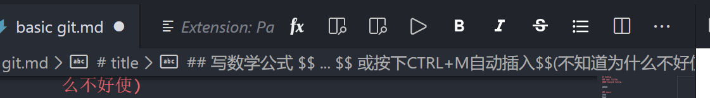
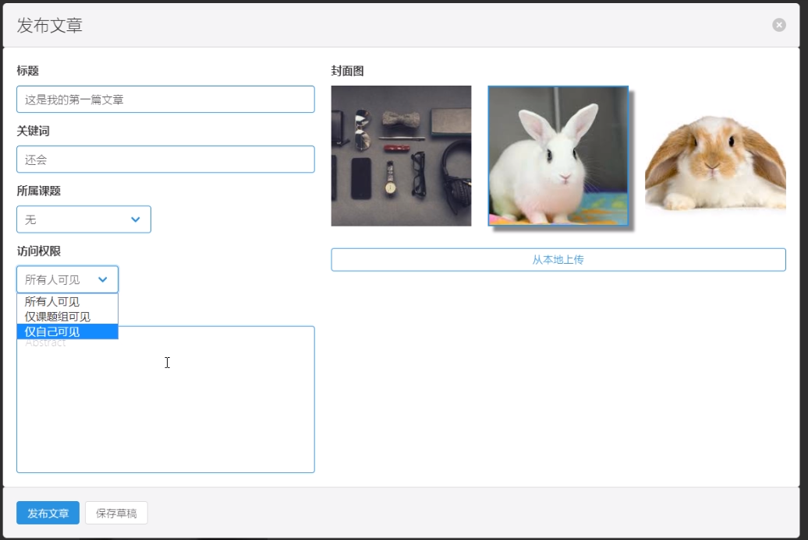

练习用，练习用。不要看。

# 我的第一篇文章
## sec title
### third title

正文就是直接写

## 段落
aaa    
bbb


## 强调
*sdf*
**ssfsf**
***ssss***

## 列表 1.空格
1. afadsf
2. 2323
3. 3242
4. 44

## 插入图片（复制图片 CTRL+ALT+V，或者CTL+SHIFT+V或者右键，两个插件的快捷键不同）方便极了。
  


## 图片已经存在了的话，先拷贝到md文件中


## 写数学公式 $$ ... $$ 或按下CTRL+M自动插入$$(不知道为什么不好使)

$$
\lim_{x \to \infin}\frac{sin(t)}{x}=1
$$

文字行里插入公式 $\lim_{x \to \infin}\frac{sin(t)}{x}=1$ 也是可以的

## 表格(键盘即可)
| a   | b     | c   |
| --- | :---- | --- |
| 1   | 22222 | 3   |

## 格式化md的表格，ALT SHIFT +F

## 插入链接。简单：复制连接，选择文字然后ctrl+V，自动识别出链接。

[本视频地址](https://www.bilibili.com/video/BV1si4y1472o?from=search&seid=2434618755716755132)

[一个介绍md的blog](https://www.limfx.pro/ReadArticle/57/yi-zhong-xie-zuo-de-xin-fang-fa)

## code ``` ```代码拷贝到中间，高亮的话需要指定语言。
```javascript 

```

## md导出成pdf，交给别人 markdown preview enhance.插件来导出。预览结果上右键-》chrome-》PDF


## md想发表到limfx上，点fx，输入账号，密码
[limfx.pro/](https://www.limfx.pro/)


### CTRL + SHIFT+ P , limfx ,

## ctrl +k ,松开按z。全屏。豪爽啊！很专注。按两下esc退出。

### markdown preview enhance : Create TOC

**总结：vscode+markdonw教程**
---

# markdown教程(一般性泛用教程)
学习它的原因：摆脱鼠标。语法简单，十个符号，能转成html。

### 1.标题用#号
# 一级标题
## 二级标题
### 三级标题
#### 四级标题
####五级标题
#### 六级标题

###2，或者用=表示一级标题，-表示二级标题
一阶
=
一阶
==========

二级标题
--


###3，字体用*包围
*斜体*
注意*号后面别有空格

**粗体**

***粗斜体***

###4，图片和链接的插入

[连接的名称](http://www.bilibili.com)

[连接的名称](http://www.bilibili.com,"bilibili")

<http://www.baidu.com>

##4.1 引用链接
[连接的名称][wangzhi]
[wangzhi]:http://www.bilibili.com


![图片名称][tupian1]
[tupian1]:https://pic.qqtn.com/up/2019-9/15690311636958128.jpg

###4.2本地图片引用


###5，引用段落
>123

###5.1 ，多层引用
>123
>>456
>>>789

###6，代码块（单行）
一个点号（对）
`public void static main(String[] args){`
            `return ; `
`}`

三个点号（对）也一样效果
```123```

###6.1 程序代码区块用四个空格
连敲四个空格，就是程序代码区块。上面是空行或标题

    public void static main(String[] args){
               return ;
    }
###6.2代码区块用四个Tab键，一样效果
        public static void main()

###7，分割线（***或---或___）
***
---
___

###8，删除线 （~~ ~~）
~~我不想考试~~

###9，无序列表（ *或-或+ 加上一个空格）

* 1
- 2
+ 3

###10，有序列表（数字加.加空格）
1. sfds
2. sfsdf
3. sfsdf

###10.1 ，多级列表
+ 123
  + 456
      + 7999 
 - aaa
   - bbb
      - cccc
1. xxx
    2. yyy
       3. zzz
 
### 11，表格(第二行可以指定对齐方式，用冒号)
| tables | Are | Cool|
|-------|:-------:|-----:|
|a|b|c|
|1|2|3|
|1|2|3|
|1|2|3|

###12，md的排版

###12.2, 缩进
四五六
&emsp;缩进一个汉字
&ensp;缩进一个英文字符
&nbsp;缩进半个英文字符

###12.3，文字居中或图片居中（用html）
<div align=center>
哈哈
</div>


###11，脚注注释 ,成对出现，自动排序

待解释[^er]
[^er]:111

###11.1 写死脚注号码
待解释[^33]
[^33]:222

---
## markdown preview enhance 
### 1, [画流程图 ，UML图，时序图，柱状图](https://www.jianshu.com/p/a9bd83b768d5)
