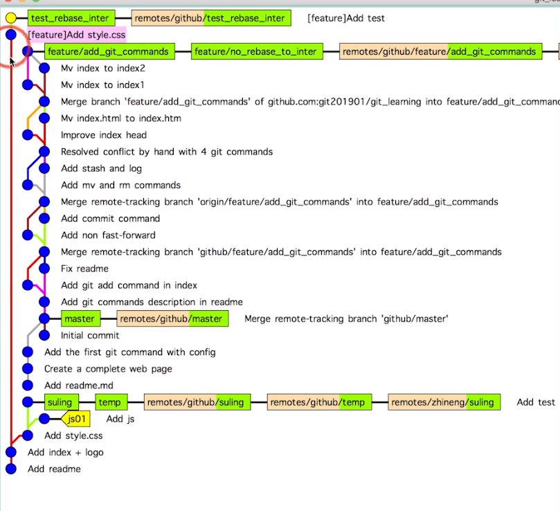
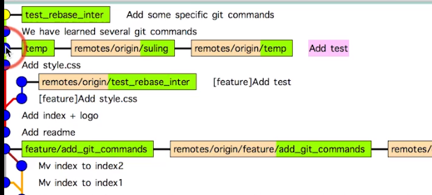

# git every day command !

 
<!-- @import "[TOC]" {cmd="toc" depthFrom=1 depthTo=6 orderedList=false} -->

<!-- code_chunk_output -->

- [git every day command !](#git-every-day-command-)
  - [一，裸仓库（都是本地.git/操作，还没有push）](#一裸仓库都是本地git操作还没有push)
    - [1,2节](#12节)
    - [3节,把已有的代码纳入git管理](#3节把已有的代码纳入git管理)
    - [04节， 结论](#04节-结论)
    - [05 节.认识工作区和暂存区](#05-节认识工作区和暂存区)
    - [06节.](#06节)
      - [1,文件重命名](#1文件重命名)
    - [07.git log 的过滤方法](#07git-log-的过滤方法)
    - [08. 图形界面的方式来看版本历史](#08-图形界面的方式来看版本历史)
    - [09. git有最优的存储能力.不用远端,就用本地的管理方法](#09-git有最优的存储能力不用远端就用本地的管理方法)
      - [9.1 .git/HEAD](#91-githead)
      - [9.2 .git/config](#92-gitconfig)
      - [9.3 .git/refs](#93-gitrefs)
      - [9.4 .git/objects](#94-gitobjects)
    - [10. 三种对象类型的关系:commit\blob\tree](#10-三种对象类型的关系commitblobtree)
      - [10.1 好的文件存储机制,保证小巧(不会越来越大),性能的关键!](#101-好的文件存储机制保证小巧不会越来越大性能的关键)
      - [10.2 看各类型文件内容学习三种文件关系](#102-看各类型文件内容学习三种文件关系)
    - [11.数数Tree的个数](#11数数tree的个数)
    - [12.分离头指针](#12分离头指针)
      - [12.1 问:什么时候用分离头指针呢?](#121-问什么时候用分离头指针呢)
    - [13. 进一步理解HEAD和branch](#13-进一步理解head和branch)
    - [14节. 一不小心搞错了之后，怎么清除分支？](#14节-一不小心搞错了之后怎么清除分支)
    - [15节. 注释写错了，怎么修改已经commit了的message内容。而且是最近一次commit的message](#15节-注释写错了怎么修改已经commit了的message内容而且是最近一次commit的message)
    - [16节 以前提交的注释写错了怎么办？](#16节-以前提交的注释写错了怎么办)
    - [17节 把过去的几个(连续的)commit压缩成一个commit，都还没有push哈！！！push过的就别动了！！](#17节-把过去的几个连续的commit压缩成一个commit都还没有push哈push过的就别动了)
    - [18节  历史中几个commit是不连续的，也要拼合在一起。本地哈。还没push](#18节-历史中几个commit是不连续的也要拼合在一起本地哈还没push)
    - [19节 实际commit之前的好习惯-  检查 。暂存区(add之后的)和HEAD比较 diff](#19节-实际commit之前的好习惯--检查-暂存区add之后的和head比较-diff)
    - [20节 工作区和暂存区的比较](#20节-工作区和暂存区的比较)
    - [21节 往暂存区里add的变更觉得没有意义或有更好的方法了。 暂存区不打算commit，想清除暂存区(暂存区与HEAD一致) --》reset](#21节-往暂存区里add的变更觉得没有意义或有更好的方法了-暂存区不打算commit想清除暂存区暂存区与head一致---reset)
    - [22节 变更进暂存区，工作区继续变。后来一看工作区的不及暂存区好。想把该文件的工作区的修改返回成暂存区的内容。变更工作区！！！！-》checkout](#22节-变更进暂存区工作区继续变后来一看工作区的不及暂存区好想把该文件的工作区的修改返回成暂存区的内容变更工作区-checkout)
    - [23节 暂存区只有部分文件想恢复成HEAD一样。](#23节-暂存区只有部分文件想恢复成head一样)
    - [24节 想让某些commit从git仓库消失。（只能是最后的连续几次commit吧）-》reset --hard](#24节-想让某些commit从git仓库消失只能是最后的连续几次commit吧-reset---hard)
    - [25节 两个分支的不同 temp vs master （仍旧在.git本地）](#25节-两个分支的不同-temp-vs-master-仍旧在git本地)
    - [26节 删除commit的文件](#26节-删除commit的文件)
    - [27节 保存工作上下文-git stash。正在修改（一部分工作区在改，一部分add，一部分commit），接到新的任务。要修改的也是同一个文件。怎么办？](#27节-保存工作上下文-git-stash正在修改一部分工作区在改一部分add一部分commit接到新的任务要修改的也是同一个文件怎么办)
    - [28节 .gitignore不纳入到git管理版本。](#28节-gitignore不纳入到git管理版本)
    - [29节 git本地备份](#29节-git本地备份)
  - [二， 到远端开始工作。本地+远端+团队操作](#二-到远端开始工作本地远端团队操作)
    - [30节 Github账户创建](#30节-github账户创建)
    - [31节 配置公钥私钥](#31节-配置公钥私钥)
    - [32节 创建Github库  （※）](#32节-创建github库-)
    - [33节 不同人修改了不同文件，怎么处理？](#33节-不同人修改了不同文件怎么处理)
      - [STEP1，A桑 修改reamde](#step1a桑-修改reamde)
      - [STEP2，B桑 修改index.html](#step2b桑-修改indexhtml)
      - [STEP3 , A桑， 修改readme](#step3--a桑-修改readme)
      - [STEP4 , B桑 ，push 失败](#step4--b桑-push-失败)
    - [34节，两个人修改相同分支相同文件，！！！不同区域！！，git还有办法！！](#34节两个人修改相同分支相同文件不同区域git还有办法)
      - [STEP1 , A桑（git2019）](#step1--a桑git2019)
      - [STEP2, B桑（suling）](#step2-b桑suling)
      - [STEP3,A桑也修改readme](#step3a桑也修改readme)
    - [35节 两个人修改同一文件的相同区域，这就比较麻烦了。冲突](#35节-两个人修改同一文件的相同区域这就比较麻烦了冲突)
      - [STEP1 A桑，B桑 都pull成远端一样的。](#step1-a桑b桑-都pull成远端一样的)
      - [STEP2 A桑，](#step2-a桑)
      - [STEP3 B桑](#step3-b桑)
      - [STEP4 A桑](#step4-a桑)
    - [36节 A桑文件名变更，B桑在原文件名变更。B怎么提交？](#36节-a桑文件名变更b桑在原文件名变更b怎么提交)
      - [SETE1 A桑](#sete1-a桑)
      - [STEP2 B桑修改index.html](#step2-b桑修改indexhtml)
      - [STEP3, A桑push](#step3-a桑push)
    - [STEP4, B桑push](#step4-b桑push)
    - [37节，多人修改同一个文件的文件名。A桑push，B怎么push](#37节多人修改同一个文件的文件名a桑pushb怎么push)
      - [A桑 改index.htm index1.html](#a桑-改indexhtm-index1html)
      - [B桑，改index.htm ->index2.html](#b桑改indexhtm--index2html)
      - [A桑，push](#a桑push)
    - [39节 禁止向集成分支执行push -f 操作](#39节-禁止向集成分支执行push--f-操作)
    - [40节 禁止向集成分支做rebase](#40节-禁止向集成分支做rebase)
    - [41节 Github为什么这么火 2008~2020年 ，3千万用户，1亿库](#41节-github为什么这么火-20082020年-3千万用户1亿库)
    - [42节 Github有哪些核心功能？](#42节-github有哪些核心功能)
    - [43节 怎么搜索Github上的项目](#43节-怎么搜索github上的项目)
      - [1， 根据库的信息搜索](#1-根据库的信息搜索)
      - [2，根据Code搜索](#2根据code搜索)
    - [44节 Github上建blog](#44节-github上建blog)
    - [45节 如何保证开源项目质量](#45节-如何保证开源项目质量)
    - [46节，Github为什么需要组织来管理](#46节github为什么需要组织来管理)

<!-- /code_chunk_output -->


## 一，裸仓库（都是本地.git/操作，还没有push）

### 1,2节
略

---

### 3节,把已有的代码纳入git管理
```
$ cd 项目代码所在文件夹
$ git init
```
// 看看是不是设置成功了  
`$ git config --global --list`  
filter.lfs.required=true
filter.lfs.clean=git-lfs clean -- %f
filter.lfs.smudge=git-lfs smudge -- %f
filter.lfs.process=git-lfs filter-process
user.name=shirongxin
user.email=shirx@ccbjb.com.cn
credential.helper=store

```
$ git config --local user.name 'tuoyekang'
$ git config --local user.email 'tuoyekang@126.com'
// gitlab.ccbjb.com.cn ,tuoyekang@126.com,1234.com
```
// 看看是不是设置成功了
```
//注意这里是local不是global
$ git config --local --list
```
core.repositoryformatversion=0
core.filemode=false
core.bare=false
core.logallrefupdates=true
core.symlinks=false
core.ignorecase=true
user.name=tuoyekang
user.email=tuoyekang@126.com


//【课题】local和global设置的用户名不一样。push到底用哪个？
```
cp ../f1/README.md .
$ git commit -m "add readme."
```
On branch master
 Initial commit
Untracked files:    //错误：该文件还没有被git管控，所以用git commit是不生效的。
        README.md
 nothing added to commit but untracked files present
  


`$ git add README.md` 

warning: LF will be replaced by CRLF in README.md.
The file will have its original line endings in your working directory.

`$ git status`  
On branch master
No commits yet
Changes to be committed:
(use "git rm --cached <file>..." to unstage)
new file:   README.md

` git commit -m "add README.md" `  
[master (root-commit) b43a16a] add README.md
 1 file changed, 1 insertion(+)
 create mode 100644 README.md

 ` git log `   
 //真的创建了 。**注意：作者是loca user不是global user！**  
 commit b43a16a5d2e9e2079558e1211f45cf218dc73cc7 (HEAD -> master)  
Author: tuoyekang <tuoyekang@126.com>  
Date:   Fri Jun 19 16:14:19 2020 +0800  
add README.md

`$ git config --global user.name`  
shirongxin

`$ git config --local user.name`  
tuoyekang


### 04节， 结论
* global 和 local都设置好之后，local优先级更高。
* git init 之后马上commit是不行的，得先git add。

---
### 05 节.认识工作区和暂存区
 
 
 工作区：add前
 暂存区：add后 commit前
 版本历史：commit之后

 /c/markdownRpo/git/git_learning
 
 `git add index.html images` 

 `git status`

 `mkdir styles`  

 `cp ../f1/styles.css ./styles/styles.css`  

 ` git add styles/styles.css`  

 ` git status ` 

 ` git commit -m"add style" ` 

 ` git log ` 

//增加一点动画  
 ` cp -f ../f1/js/scrips.js .`

```
git add js
git commit -m'add js'
git log
```

//增加参考项目,修改header.html怎加页脚，并编辑css改变页脚风格   
`git status`  
提示两个文件修改了  
`git add -u` //一起add不必写所有文件名  
`git commit -m'Add refering prj'` //一起提交  
`git log `  

<font color=red>#### git好习惯总结:  </font>

  *为了做某件事情,把改增加或修改的文件,放到git add进来,然后等都修改好了之后,测试功能实现了,再一次性git commit.* 

---
### 06节. 

#### 1,文件重命名
`mv README.md readme.md`  
`git status`  
//显示你把README.md删掉了,同时你又新增了一个readme.md

```
git add readme.md
git rm README.md
git status
```  
//显示renamed : README.md -> readme.md

`git reset --hard`  //暂存区所有的变更都被清除掉.
`git status` 
并没有破坏git的历史,就是暂存区是干净的

**其实git mv 命令就可以改名字,一步=两步**
```
git mv README.md readme.md
git status
git commit -m'Move README to readme'
git log
```

---

### 07.git log 的过滤方法
`git log --oneline` //非常简洁地一次commit一行地格式输入历史

`git log -n4 --oneline` //只需要最近的4次commit注释

```
git branch -v  //查看当前分支  

//创建一个分支基于某版本ID叫temp分支,并切换到该分支
git checkout -b temp  版本ID(每次commit会产生一个)的前部分即可不用写全  

vi readme.md //稍作修改
git commit -m"add test"
git commit -am'add test' //强制创建到历史版本库
git branch -av //查看分支(的最后一次提交的版本)
git log //只看当前分支的历史(现在是HEAD->temp)
git log all //所有分支的历史(temp,master)
//查看分支指向了哪个commit

git log --all --graph //图形化地查看分支

```

**总结:(这个命令就等于生产力)**
// 简化版,最近4个commit,所有分支,图形界面看commit历史
  `git log --oneline --all -n4 --graph`

---

### 08. 图形界面的方式来看版本历史
`gitk` //弹出图形化


>切换成tree之后,显示的是文件目录的所有内容.Patch应该是变化的内容
>> 作者:A桑,提交人:B桑 .这种情况:B从A的某个提交作为分支,作者保留为A桑.
>
>> A提交是有Child的.Child指:以A为基础的一次提交B.B就是A的Child.就像子子孙孙传承串,子永远是新的提交.
>
>> Branche:和这次提交产生关联的分支.可能一个也可能多个.

gitk 可以定制查看版本历史的内容

1. new view
2. all refs //查看所有branch信息
   
3. 还可以在上图上右键,有很多功能,例如tag.
   

以后会打开这个gitk,看看现在变更成什么样子了.

---

### 09. git有最优的存储能力.不用远端,就用本地的管理方法

#### 9.1 .git/HEAD
`git init ` // 生成git的文件夹.
`cd .git` // 其中HEAD

`cat HEAD` // 查看当前分支
ref:refs/heads/temp

//[lab]切换分支,看看HEAD内容会不会变
```
cd ..
git checkout master
cat ./git/HEAD
```
ref:refs/heads/master

#### 9.2 .git/config
`cat .git/config`  
//输出**local** config

`修改config文件,把名字改为shirongxin`

`git config --local --list `
`git config --local user.name`
输出shirongxin
```
git config --local user.name 'tuoyekang'
cat .git/config
```
输出tuoyekang

**结论:.git/config就是记录local config的地方,命令改的就是这,所以可以直接该文件.git/config来修改local user.name local user.email**

#### 9.3 .git/refs
进入看看里面的文件内容.
```
cd refs //显示heads,tags两个目录
cd heads 
ls -al //显示master,temp两个文件
cat master // 是一个长字符串(commit的hash值)
git cat-file -t 把上个命令的长字符串的前一部分贴到这 // 看文件类型.结果是:commit
git branch -av // 查看所有分支
//master 指向了上面那个长字符串(截取前面一部分7个字符)
cat temp // 同上,一个长字符B,是temp分支的commit文件.

```

**结论:.git/refs下面就是所有分支的指针指向的commit.还有tags指向的commit**


#### 9.4 .git/objects 
进入后,有两个字符的目录 , info , pack
```
cd e8
ls -al //显示一串,例如abc...z(40位)
git cat-file -t e8abc...z //把e8 放在长串前面. 结果:tree
git cat-file -p e8abc...z //看这tree的文件内容. 结果:文件的size,blog,文件的hash值,文件名

```
**结论:三种文件类型 commit,tree ,blob,**

---

### 10. 三种对象类型的关系:commit\blob\tree
#### 10.1 好的文件存储机制,保证小巧(不会越来越大),性能的关键!
先看看图,一会再执行具体命令.

* tree就是文件夹 ,例如images ,例如styles
* blog就是具体某个文件,例如index.html , readme.md
<font color=red size=3>*只要文件内容相同,git就认为是一份blob,大大节约存储空间*</font>
* commit就是一次提交

#### 10.2 看各类型文件内容学习三种文件关系
```
git branch -v
// show current branch
git log
// show commit hash
git cat-file -p [commit's hash]
// tree hash
git cat-file -p [tree's hash]
// show blob hash
git cat-file -p [blob's hash]
// show file content
```

---
### 11.数数Tree的个数


```
git init watch_git_objects
cd watch_git_objects
mkdir doc
cd doc
echo "hello world" > readme
git status

find .git/objects -type f
//没有新东西

//1,add
git add doc
find .git/objects -type f
//有新东西 hashcode

git cat-file -t hashcode
git cat-file -p hashcode

//2,commit
git commit -m'add readme'
find .git/objects -type f
//竟然生成4个文件,依次看看文件类型和内容
git cat-file -t hashcode
git cat-file -p hashcode
//前两个分别是doc目录和readme文件. 
//第三个文件也是tree,也是doc文件夹.
//最后一个文件是commit


```
**结论:两个tree(watch_git_objects目录,doc目录),一个blog,一个commit**  

---


### 12.分离头指针
很有用
```
git log
git checkout commitHash // in detached HEAD 

```
你可以继续开发,没有对应任何分支.
**假设每天你接到fix任务需要切换到某个branche,那么这个分离头指针的所有变更都将被清除**

#### 12.1 问:什么时候用分离头指针呢?
答:原本就是不想提交的尝试性修改.
```
ls -al
vi ./style/style.css //修改一下颜色
git status //又提示我们HEAD detached at 红字
git commit -am'不用add直接commit' // 没经过add,直接能commit
git log
```
HEAD的位置一般显示master或分支名.这里直接显示HEAD(而不是任何分支名),这就是分离头指针


假设,有人让我fixbug,我得切换到别的分支
```
git branch -av
git checkout master
```
<font color=red size=3>有个重要提示:you are leaving 1commit behind,
not connect to any of your branches.If you want to keyy it by 
creating a new branch ,**git branch new-branch-name hash** </font>看到这个马上qu去创建一个branch保存这次修改，然后再去切换到别的分支。

```
git branch new-branch-name hash //本该做这个，如果不做，下面的操作会让这些commit消失
git checkout master
gitk -all //查看不到在分离头指针上的任何修改！！！切记！！

```
---

### 13. 进一步理解HEAD和branch
```
git branch -av
git log  //HEAD 不仅可以指向具体分支，还可以指向具体commit（ 指向具体非branch的时候，就处于分离头指针的状态了!!）
```

```
git checkout -b fix_readme hash(可以commit或分支的hash)//创建分支（新建分支）并切换、
git log
gitk --all
cat ./git/HEAD // 指向fix_readme分支
```


**总结：**
* HEAD可以某个commit或分支或tag。
* HEAD指向非分支的commit的时候，是分离头指针状态
* 当切换分支的时候HEAD也就指向了该分支
* 分支是什么？分支最后也落脚到某个具体的commit。
> cat ./git/refs/heads/fix_readme //得到hash
> git cat-file -t 该hash //得到commit类型


`git diff 具体两个commit //查看两个commit不同`
```
//三条命令效果一样，比较HEAD与HEAD的父亲
git diff HEAD HEAD~1
git diff HEAD HEAD^1
git diff HEAD HEAD^
```
```
//比较HEAD和HEAD的爷爷
git diff HEAD HEAD^^
git diff HEAD HEAD~2
```

### 14节. 一不小心搞错了之后，怎么清除分支？
`git branch -av`
创建了没什么意义的分支，怎么删除？
先看看分支的树结构,想删除**fix_readme,9c68**
`gitk --all`


```
git branch -d 9c68xxx // 分支名。
//删不掉用 -D
git branch -D 9c68xxx

gitk --all // 9c68xxx不见了

```


接着删除fix_readme分支
```
git branch -D fix_readme
git branch -av //就剩下两个
gitk --all
```

**总结：**
&ensp 删分支：git branch -D 9c68xxx（分支hash）

### 15节. 注释写错了，怎么修改已经commit了的message内容。而且是最近一次commit的message

```
git log -1
git commit --amend //进入修正界面，像vi一样修改
git log -1 //比对一下message。真的变了

```

注意：是最近一次commit的提交才行

###  16节 以前提交的注释写错了怎么办？

```
git log -3
/**
message是commit对象的属性。但是改的不是commit本身而是指定了他的父亲。
进去之后是交互式（vi）修改
**/
git rebase -i commit的父亲的Hash  
// 1，显示 pick xxx
// 修改处理策略 pick 修改成reword或r 。然后：x -》又弹出另外一个交互
// 2，编辑message，退出来

git log -3 //确认一下是否修改

```

**总结：变基git rebase commit的父亲hash  //修改以前的注释**

**<font size=4 color=red>注意：目前为止都没有分享给别人，都是自己本地操作！！！！都是自己本地操作！！！！</font>**

---

### 17节 把过去的几个(连续的)commit压缩成一个commit，都还没有push哈！！！push过的就别动了！！
```
git branch -av
git log 
```
从倒数第二个commit到正数第二个commit合并成一个commit。
都还没有push，所以可以整理一下

```bash
git rebase -i
```

**修改**：第一个pick，剩下的squash，最后第一个pick 。 保存


这样就改完了，再看看
```bash
git log --graph
```
合并后的commit是一个新的commit。它的子节点也变了。但是内容没变。


---

### 18节  历史中几个commit是不连续的，也要拼合在一起。本地哈。还没push


```bash
git rebase -i f09122cf
```

增加一行：pick f019122c
修改： s 5cc5aa3 （意思是和第一行f019122c合并）
不动：pick 34e735
删除；pick 5cc5aa3 (多余，因为上面已经把它的内容合并到f019122c里了)
```bash
git log --graph
```


这样版本上就干干净净的了，因为coomit ID变了，所以就有了两个树！！

上面的是需要保留的。下面的就没有用了。


---

### 19节 实际commit之前的好习惯-  检查 。暂存区(add之后的)和HEAD比较 diff

先做一个文件内容变更
```bash
git add index.html
git status
git diff --cached // cache表示暂存区和HEAD的比较，文件名不用写！！
```
再变一下
```
git add index.html
git diff --cached // 暂存区 vs HEAD
```
再commit一下
```
git commit -m'add the first git command with config'
```


### 20节 工作区和暂存区的比较

先修改一下index.html还没有add到暂存区
工作区（没add之前=真正的本地）,和暂存区差异
```
git diff // 工作区 vs 暂存区
```
再修改一下readme.md
```
git diff  // 工作区 vs 暂存区
```
查看具体文件(可多个)的差别
```
git diff -- readme.md index.html // 工作区 vs 暂存区
```

### 21节 往暂存区里add的变更觉得没有意义或有更好的方法了。 暂存区不打算commit，想清除暂存区(暂存区与HEAD一致) --》reset
```
git status
git reset HEAD //恢复暂存区与head一致
git status
git diff --cached 
```

### 22节 变更进暂存区，工作区继续变。后来一看工作区的不及暂存区好。想把该文件的工作区的修改返回成暂存区的内容。变更工作区！！！！-》checkout

```
git checkout  -- index.html // 暂存区->工作区
git diff   // 工作区 vs 暂存区
cat index.html //已经恢复成暂存区了。
```

### 23节 暂存区只有部分文件想恢复成HEAD一样。
```
git reset HEAD --style/style.css //恢复暂存区成HEAD
git diff --cached // 暂存区 vs HEAD
git status 
```
//把另外两个文件也变成和HEAD一样。从暂存区中撤销出来，就没有commit的必要了
```
git reset HEAD -- index.html readme.md // 暂存区两个文件恢复成HEAD

```

### 24节 想让某些commit从git仓库消失。（只能是最后的连续几次commit吧）-》reset --hard
例如temp分支，最后的remove all
倒数第二个“Rename git-log to git-log2”这两个commit我不想要了。


```
git branch -av
```
当前分支确实在temp下。

```
git log
```
想保留到该commit，这个commit之后的变更都丢弃

```
git reset --hard 5bf3fd1900 // commit的内容抛弃后面几个commit
```


### 25节 两个分支的不同 temp vs master （仍旧在.git本地）
```
 git diff temp master // temp分支 vs master支
 git diff temp master index.html // 某个具体文件在两个分支的差异 
```
还可以用某个具体的commit来比较。temp上的commit与master的commit的hash不同
```
git branch -av //显示所有branche的当前commithash
git diff tempCommitHash masterCommitHash // 比较两个分支的两个commitHash
git diff tempHash masterHash index.html // 与上面的git diff temp master index.html 结果一样。
```

### 26节 删除commit的文件
例如readme.md不想要了。

```
rm readme.md
git rm readme.md // 删除暂存区的readme.md文件
git status
```

``` 
git reset --hard HEAD //恢复暂存区成HEAD
git status
```

```
git rm readme.md // 工作区和暂存区和commit区都删除了。工作目录就不需要珊瑚了。
git status 
```

### 27节 保存工作上下文-git stash。正在修改（一部分工作区在改，一部分add，一部分commit），接到新的任务。要修改的也是同一个文件。怎么办？

```
git stash // 先保存某个地方
git stash list // 保存堆栈的信息
git status // 工作区是干净的。
//紧急修复bug，commit之后，恢复之前的工作
git stash apply //这就恢复了之前的状况
git status
git stash list //还是那么多
```

把工作上下文调用出来。pop有所不同
```
git reset --hard HEAD //让工作区干净
git stash pop // stash删掉一个，工作区恢复成原样
```

### 28节 .gitignore不纳入到git管理版本。
学会写.gitignore文件（到github上查看现成的.gitignore文件）,
**必须叫这个文件名**
写法：
```
*.log
*.class
*.war
*.DSYM/  这个目录的所有文件都不放进来版本管理
```

+ doc目录需要git管理，而doc下面文件不需要
//来具体操作一下
.gitignore 
`doc/`指的是doc/下的所有文件不纳入git。但是doc目录本身是纳入git管理的。
  ```
  mkdir doc
  git status
  ```
  可以看到doc仍提示需要add！    
    

  
+ 如果doc也不需要git管理
  .gitignore
  `doc`
  这样doc和doc下的文件都不需要git管理了

查看github上的各个语言的.gitignore

### 29节 git本地备份
哑协议 慢，不可见进度条，所以，推荐只能协议。
http需要用户名密码
ssh需要公钥私钥


还可以多点备份（fetch）


//备份的先


//备份的元

```
//--bare不带工作区 ，进入到备份先
cd /User/suling/666-backup
//哑协议clone 把备份元的.git 拷贝到备份先目录ya.git
git clone --bare /User/suling/101-GitRunner/git_learning/.git ya.git
//智能协议clone 
git clone --bare file:///User/suling/101-GitRunner/git_learning/.git zhineng.git  //这就备份完了

```
在备份元上因为是我们的主要工作空间，大部分时间都在备份元上工作。所以备份袁尚会有新的分支，新的文件。备份元就叫本地。这时我们需要把本地的变更同步到远端去（同步到备份先去）
现在演示：本地（101-GitRunner/git_learning）push到远端备份先（666-backup）

1，本地增加一个备份先信息
```
cd /User/suling/101-GitRunner/git_learning //工作在本地仓库
git remote -v
git remote add zhineng file:////User/suling/666-backup/zhineng.git //新建一个远端仓库信息，名字叫智能，地址是后面的智能协议地址,以后本地就往这里同步备份
git branch -av
```

2，显示远端的分支：
```
cd /User/suling/666-backup/zhineng.git  //远端备份先
git branch -av
```
3，本地新增一个分支，并push到备份先
```
cd /User/suling/101-GitRunner/git_learning //工作在本地仓库
git checkout suling //增加一个分支
git push --set-upstream zhineng suling //分支push到远端
```

4，查看远端备份先应该也有新的分支了
```
cd /User/suling/666-backup/zhineng.git  //远端备份先
git branch -av
```

---

## 二， 到远端开始工作。本地+远端+团队操作

### 30节 Github账户创建
developer 每月7$有无限的私有库。
free 私有库有限制

### 31节 配置公钥私钥
有了之后，本地git库才能往github上push
gothub help，搜索ssh，找到“Connecting to Github with ssh”
这就是代表你个人的身份。可以配置到多个git服务器。

https://help.github.com/en/github/authenticating-to-github

https://help.github.com/en/github/authenticating-to-github/adding-a-new-ssh-key-to-your-github-account

```
cd ~/.ssh/
ssh-kegen -t rsa -b 4096  -C "shirx@ccbjb.com.cn"
一路回车
cd ~/.ssh/
ls -al
cat id_rsa.pub //这是要放到web上的。
```

进入GIthub->setting->ssh and GPG keys -> add new SSH key.
把id_rsa.pub内容拷贝进来。

这样，push就不需要用户名密码了。

我的github用户，shirx@ccbjb.com.cn已经把公钥放上去了。

### 32节 创建Github库  （※）
owner：可以个人，可以组织
私有仓库，owner授权你才能看见
共有仓库，谁都能看见，commit需要授权
readme对github高效搜索的时候非常有用。因为需要到readme搜索关键字

MIT License：愿意分享出来
>创建github仓库
>【Q】本地仓库的文件和github仓库的文件不一样，怎么处理？
>>

```
cd /User/suling/666-backup/zhineng.git //本地备份仓库
git remote -v
```
github上git201901/git_learning库->clone ssh拷贝ssh的url

```
666-backup
//【Q】这个命令在哪执行有区别吗？
git remote add github git@github.com:git201901/git_learning.git // 用github代替这串ssh地址，在本地新增一个远端站点
git remote-v //能看到github的远端地址了。
```

```
git push github --all
```
***发现suling分支push成功，temp分支push成功。但是master分支拒绝了。提示因为master分支github有你本地没有的内容。应该先fetch***


```
gitk --all //看看本地分支的样子
```

将github的拉到本地
```
// git pull = git fetch + 本地分支和远端分支merge
git fetch github master //把github的master分支拉下来
gitk --all
```
三克独立的树。最上面的remote/github/master里的内容是“License文件”
“没有基于github远端做变更，所以不让push”-既non-fastforward。


```
git branch -va 
```


```
git checkout master
//把当前分支(master分支)与github/master做合并
git merge github/master  //报错：refusing to merge unrelated histories
git merge -h //找找帮助
git merge --allow-unrelated-histories github/merge //弹出
gitk --all
```
新生成的节点有两个父亲。而rebase有一个父亲。

>{Q}本地master和github/master的关系是不是fast forward。

```
//本地push可以了
git push github master // 
gitk --all
```
push带来的影响。g


github上也不是1个commit了，而是5个commit了。

### 33节 不同人修改了不同文件，怎么处理？
模拟两个人，同一个分支当中，两个人修改了不同的文件。
github上master基出上创建分支feature/add_git_command
一个人修改一个readme
另一个人


suling@163.com 管理者

#### STEP1，A桑 修改reamde
```
cd  新目录 
git clone  git@github.com:git201901/git_learning.git git_learning_02
cd git_learning_02
// 模拟成另一个人的工作环境
git config --add --local user.name 'git2019' //这仅仅对本库有用
git config --local --list //针对本仓库，用户名是否已经调整
```
**总结：git config --add --local user.name 'xxx'仅仅对本库有用。对其它库（其它.git目录没有影响），对git config --global也没有任何影响**
然后再变变这个库的邮件地址
```bash
git config --local --add user.email 'git@163.com'
或者直接修改.git/config文件里的user ！！！ 也可以！！！
```
两个人都checkout出github上的分支

```bash
cd git_learning_02
git checkout -b feature/add_git_commands origin/feature/add_git_commands
git branch -av 
// 修改 readme vi readme
add readme
git commit -m"edit readme ' //本地变更完
// 分享到github变更
git push //缺省的remote就是feature/add_git_command .创建分支时指定了远端分支，git就记住了
```
到github上刷新一下，已经readme已经改了。


#### STEP2，B桑 修改index.html
```bash
cd git_running //进入另外一个库
git config --local -l
git fetch github //把github上所有分支下载下来
git branch -v //本地分支
git branch -av //远端分支
git checkout -b feature/add_git_commands github/feature/add_git_commands //创建本地分支
vi index.html
git add -u 
git commit -m 'Add git command in index.html'
```

#### STEP3 , A桑， 修改readme
```bash
vi readme
git commit -am''
git push
```

#### STEP4 , B桑 ，push 失败
```bash
git push //远端和本地“不是fastfoward”（远端更加新）.必须解决。
git fetch github
git branch -av 
//[ahead 1,behind 1] 本地有个文件比远端新。本地还有一个文件比远端旧。
git github/feature/add_git_commands //缺点：不线性。git很容易完成，因为没有相同的文件被多人修改。
cat readme //A桑的修改，已经反映进来了。
git push github  //很顺利。因为是fastforward了。
```

### 34节，两个人修改相同分支相同文件，！！！不同区域！！，git还有办法！！

#### STEP1 , A桑（git2019）
```bash
git branche -av
[behid 2] //本地有两个文件比远端旧
git pull //用远端更新本地
git branch -av 
```

#### STEP2, B桑（suling）
```bash
vi readme
git commit 
git push
```

#### STEP3,A桑也修改readme
```bash
vi reame
git commit
git push // 会失败。因为B桑已经提交了，而A没有在B的基础上修改。有冲突Not Fastforward
```

解决：pull 或  先fetch在merge
采用第二种方法
```
git fetch 
git merge origin/feature/add_git_commands
la -al
cat index.html // B桑的修改已经反映进来了。
gitk --all
```

```bash
git branch -av //[ahead 2],没有behind只有ahead，提交肯定没问题
git push
git branch -av //没有ahead或behind
gitk --all
```
Github上看看，已经提交上去了。

### 35节 两个人修改同一文件的相同区域，这就比较麻烦了。冲突

#### STEP1 A桑，B桑 都pull成远端一样的。
#### STEP2 A桑，
```bash
vi index.html
git commit -m'add by A桑'
```
#### STEP3 B桑
```bash
vi index.html
git commit -m'add by B桑'
git push
```
#### STEP4 A桑
```bash
git push // 失败. 
git merge github/feature/add_git_commands //already up to date
git pull // 跟本地分支做merge。Merge confilict in index.html
```
有命令行的，和图形话的解决方案

1，命令行方式人工解决本地冲突
git不能帮助解决了，需要人工，编辑index.html文本.留下人工合并好的内容。保存。
```bash
git status // 还有Unmerged path
git commit -am'Resolved conflict by hand with 4 git commands'
git status
gitk --all 
git push //本地解决了冲突之后放到远端
```

**总结：解决同一文件冲突**

### 36节 A桑文件名变更，B桑在原文件名变更。B怎么提交？

先两个环境.git都git pull更新最新的内容到本地


#### SETE1 A桑
```
git mv index.html index.htm
git commit -am'mv index.html to index.htm'
```

#### STEP2 B桑修改index.html
```
vi index.html
git commit -am'modify index.html'
```

#### STEP3, A桑push
```bash
git push
```

### STEP4, B桑push
```bash
git push // 失败
//git能够感受到文件名的变更，直接pull，B桑对index.html的修改就会反映到index.htm中。
git pull //ok
ls -al //只有index.htm了！！！ 太智能了
cat index.htm // B桑的修改也保留了 ！！，太智能了
```

**总结：pull就可以了**

### 37节，多人修改同一个文件的文件名。A桑push，B怎么push
#### A桑 改index.htm index1.html
```
git mv 
git commit
```
#### B桑，改index.htm ->index2.html
```
git mv 
git commit
git push github //ok
```
#### A桑，push
`git push` // NG 
解决：
```
git pull // 报冲突了
ls -al //出现了index1.html , index2.html
git status //both deleted , add by us:index1.html , add by them :index2.html // 这就得认为协商了，到底删掉哪个，决定好了之后，叫index1.html
git rm index.html
git add index1.html
git status
git rm index2.html
git status // ALL conflict fixed out .
ls -all
git commit -m'Decide to mv index to index1'
git status
gitk --all
```


```
git branch -av
git push 
gitk --all
```

### 39节 禁止向集成分支执行push -f 操作

**git push -f 的危害**
会让别人的变更commit统统消失！！！

git reset --hard hashcode
git push -f origin feature/add_git_commands //强制更新

github上已经提交的都消失了。

**有没有什么机制，让gitlab或github不允许push -f ？**
有


### 40节 禁止向集成分支做rebase

**注意：公共的分支不是能做rebase做变基的**


<font color=red>test_rebase_inter分支是基于temp的，原本没做rebase的话，temp之后的两次commit能够顺利提交。但是现在rebase之后test_rebase_inter分支已经离开了temp分支了。这就not fastforward了。最上的黄点就push不了了。所以不能团队合作时rebase分支(仅仅改commit message也不行)。只能不断向前。</font>



### 41节 Github为什么这么火 2008~2020年 ，3千万用户，1亿库

**它的价值：**
+ 程序员的协作，更好的版本控制系统
+ SVN需要等待授权fork分支花费时间非常长
+ 帮助开发人员寻找开源项目
+ 不断解决软件开发人员的痛点：代码集成、集成环境、部署

### 42节 Github有哪些核心功能？
Features
+ Code review //无缝的，在评论处就可以审评
+ project manager //产品->开发->测试->运维 ，有看板，进度，issure（需求，bug），对isuue打标签。简洁yi'yong
+ Integration
+ team manager
+ social coding
+ Document
+ Code hosting //放代码

### 43节 怎么搜索Github上的项目
#### 1， 根据库的信息搜索
可以看github的[help](https://help.github.com/en/github/searching-for-information-on-github)
+ created:<2018-12-24
+ [高级搜索](https://github.com/search/advanced?q=created%3A%3C2018-12-09&type=Repositories) 可以更直观。
+ 星数越多越好
+ 搜索栏查的是：搜索→repository的名称和描述。
+ 搜索栏[xxx in:readme] : 搜索→readme
   + git 最好 学习 资料 in:readme
+ 搜索栏[ starts:>1000]
+ language:javascript
+ forks:>1000
+ blog easily start in:readme starts:>5000
  
#### 2，根据Code搜索
+ 根据代码内容来搜索
   + 'fater_script:'+'stage:deploy' filename:gitlab-ci
   但是这样只能搜索出代码
   + 

**总结：**
   目前库和代码的搜索无法结合。

### 44节 Github上建blog

1. blog easily start in:readme stars:>5000
2. jekyll-now
3. fork
4. 修改config.yml
5. 增加md code→_post→2020-06-20-xxx.md 
6. setting→GitHub Pages→点域名。

_post/下面可以创建目录。目录里面建md，但是文件名字只能是yyyy-mm-dd-title.md
他能自动遍历子目录找到md，显示在主页上

project/images存放所有文件。md引用这些文件的时候


### 45节 如何保证开源项目质量

code review
checks CircleCI 自动化检查机制 dockerfile-lint , bold ,eslint ,test-integration , test-app, test-unit, ...

**没说具体怎么做**

### 46节，Github为什么需要组织来管理
Personal Setting → Organization→邀请member加入
组织下面有仓库
Teams对仓库精细化管控：Team对仓库，Team类似角色有权限的。
Gitlab的仓库对没有权限的用户不可见，而GitHub对没权限的用户开发看的权限,能看到库的信息。

1. 创建组织
2. 邀请成员
3. 创建仓库
4. 创建Team，管理仓库
5. 成员申请仓库
6. 管理员审批申请


