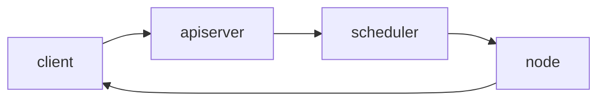

[资料来源](https://www.bilibili.com/video/BV1mE411u7dR?p=10)
## 1，概念

master节点
  + apiserver：接受客户端指令
  + scheduler：选哪个node启动服务
  + controller manager：想node的kubelet发送指令

node节点
  + kubelet ：管理docker容器
  + kubeproxy：管理docker容器的网络

etcd就是做存储
  + 记录node信息（ip，是否可用）
  + 检查client是否是合法用户
  + 用apiserver与etcd交互

pod
  + 一组容器
  + 最小的部署单元，k8s只能启动pod，而不能往下直接启动容器
  + pod是短暂的，运行完就消失
  + 有地址，不对外

controller
  + 控制pod，启动，删除
  + Deployment
  + Job
  + DaemonList

service ：提供一个同一的入口，即使pod改变，这个入口不变，保证用户访问不变
  + pod的集合（nginx多个pod，php多个pod，mysql多个pod）
  + 有地址，对外
  + pod的地址死后新创建会和原来不同，为了外部和k8s通讯，引入service
  + 创建pod之后，会在service里注册。
 

label : 我怎么知道service关联哪个pod呢？
  + 用标签，表明pod属于nginx，还是php，还是mysql
  + 用来给pod打标签的，service通过标签来关联一组pod

Namespace：分离pod不让他们互相访问。业务隔离。
  + 使用场景：为不同公司提供隔离的pod运行环境
  + 使用场景：同一个公司，为测试，开发，生产分为三个名字空间，来隔离。
  + 默认pod可以互相访问的。这就不安全。 

---
※ markdown preview enhanced 还可以画时序图,并且可以选主题

```sequence{theme="hand"}
client->master : apiserver
Note right of master : apiserver receive \n client command.
master-->client : how are you
client->master : I m good 
```



```flow
st=>start: Start:>http://www.baidu.com[blank]
e=>end:>http://www.baidu.com
op1=>operation: my operation
sub1=>subroutine: My subroutine
cond=>condition: Yes
or No?:> http://www.baidu.com
io=>inputoutput: catch someting

st->op1->cond
cond(no)->sub1(right)->op1
cond(yes)->io->e
```

--- 
上面纯属娱乐。

## 2，搭建部署k8s
 

### 2.1 计划
 + 用**离线**部署：下载所有安装包，然后不用上网，公司内部部署
 + **生产环境**：不适用单master，而是**多master**集群（HA）master3台，node多多益善。node不直接与master通讯，而是通过LB。**LB也是两个**，防止故障。etcd也需要有三台节点。 master,etcd的台数必须是**单数**。
   
 + 学习环境：没用LB。单个master，三个etcd。
 

 实验环境最终按生产环境来规划，需要六台虚拟机
  
    
+ 实验环境规划
  + 2G内存，2核CPU 
  + 6台虚拟机

### 2.2 三种部署方式
  

采用二进制的方式。能更了解各个组件。
### 2.3 部署单master集群。
#### 一、集群规划：
   master
       主机名：centos1，192.168.3.105
   worker
       主机名：centos2，192.168.3.106
       主机名：centos3，192.168.3.107
   k8s版本： 1.16 
   安装方式：离线二进制
   操作系统版本：centos7.1

#### 二、所有服务器都初始化（先后顺序无所为）
  1，关闭防火墙
  2，关闭selinux
  3，配置主机名
    `hostnamectl set-hostname xxxxx`
  4，名称解析
    /etc/hosts配置三个虚拟机的名字
  5，配置时间同步
  **master：**
  ```
    yum install chrony -y
    vim /etc/chrony.config
    修改三项
       server 127.127.1.0  iburst
       allow 192.168.3.0/24
       local stratum 10 
    systemctl start chronyd
    systemctl enable chronyd
    ss -unl | grep 123
  ```
  **node1，node2**:
  ```
    yum install chrony -y
    vim /etc/chrony.config
    修改一项
       server 192.168.3.105 iburst
    systemctl restart chronyd
    systemctl enable chronyd
  ```

  确认一下
  `chronyc sources`

  6，关闭交换分区


##### 插入知识点： **证书用来组件之间通讯https**
```
 **加密形式：**
   + 对称加密：加密解密同一个密钥（非常不安全）
   + 非对称加密：公私钥，公钥加密，私钥解密。私钥保存在淘宝服务器那，公钥下载到自己那。然后自己发给淘宝的都是用公钥加密的，淘宝能解开。
   + 单向加密：只能加密不能解密。MD5，只能校验文件被篡改过。

 
 + 谁颁发的
 + 发给谁的
 + 加密算法
 + 过期日

你们公司做的电商网站。客户访问你用https。你网站的ssl证书哪来的？
1. 从网络第三方机构购买,通常用外部用户来访问
2. 自己给自己发证书，外部客户访问时会出现不受信任的。

证书办法机构（CA）

自建CA
  openssl
  cfssl（推荐，因为更简单）

通过这个CA来颁发证书

通过证书来进行https通讯
```
#### 三，部署ETCD
 etcd需要三台虚拟机，给etc的颁发证书。master基于https访问etcd
  

1) 解压缩/root/tar TLS.tar.gz
TLS/
 + etcd
 + k8s
 + sh cfssl.sh //执行该脚本


2) 填写表单--写名etcd所在节点的IP
```
cd TLS/etcd // 为ETCD颁发证书
vim server-scr.json
 当前证书是发给哪个主机的。下面IP写etcd虚拟机的IP
   hosts： 
     "192.168.3.108",
     "192.168.3.109",
     "192.168.3.110"
   别的不用该
```

3)  创建CA(master→etcd) 给tecd颁发证书
`TLS/etcd/generate_etcd_cert.sh`
   ```
    生成
    ca.pem
    ca-key.pem
    (调用server-scr.json颁发证书)
    server-key.pem
    server.pem
   ```

4）在虚拟机上安装etcd
  /root/k8sFiles/etcd.tar.gz
`  tar xvf etcd.tar.gz`
  拷贝过来就能用。
  注意：解压后生成一个文件和目录usr/lib/systemd/system/。
  + etcd.service //执行/opt/etcd/bin/etcd
  + etcd/
```
  * 把etcd.service放到/usr/lib/systemd/system/
  * 把etcd/放到/opt下
```
>centos7 systemd 服务管理脚本在哪个目录？
  /usr/lib/systemd/system/

`vim /opt/etcd/cfg/etcd.conf`
```
**[Memeber]**
+ ETCD_NAME #ETCD的唯一名字,三个节点分别不同即可Cluster.
+ ETCD_DATA_DIR #数据库的位置
+ ETCD_LISTEN_PEER_URLS #ETCD接收其它ETCD通讯的端口
+ ETCD_LISTEN_CLIENT_URLS #ETCD接收master通讯的端口

**[Cluster]**
+ ETCD_INITIAL_ADVERTISE_PEER_URLS
+ ETCD_ADVERTISE_CLIENT_URLS
+ ETCD_INITIAL_CLUSTER
```

etcd1的虚拟机上的配置:
 
