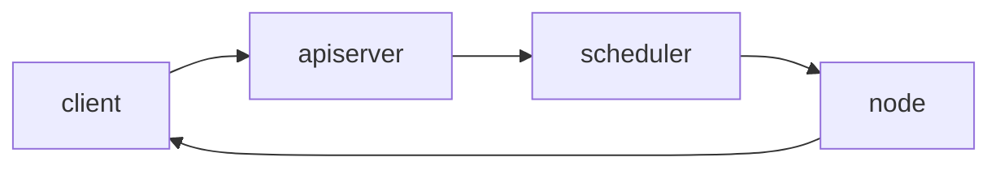

讲的还行，我记下来留着动手实验。

[资料来源](https://www.bilibili.com/video/BV1mE411u7dR?p=10)
## 1，概念

master节点
  + apiserver：接受客户端指令
  + scheduler：选哪个node启动服务
  + controller manager：想node的kubelet发送指令

node节点
  + kubelet ：管理docker容器
  + kubeproxy：管理docker容器的网络

etcd就是做存储
  + 记录node信息（ip，是否可用）
  + 检查client是否是合法用户
  + 用apiserver与etcd交互

pod
  + 一组容器
  + 最小的部署单元，k8s只能启动pod，而不能往下直接启动容器
  + pod是短暂的，运行完就消失
  + 有地址，不对外

controller
  + 控制pod，启动，删除
  + Deployment
  + Job
  + DaemonList

service ：提供一个同一的入口，即使pod改变，这个入口不变，保证用户访问不变
  + pod的集合（nginx多个pod，php多个pod，mysql多个pod）
  + 有地址，对外
  + pod的地址死后新创建会和原来不同，为了外部和k8s通讯，引入service
  + 创建pod之后，会在service里注册。
 

label : 我怎么知道service关联哪个pod呢？
  + 用标签，表明pod属于nginx，还是php，还是mysql
  + 用来给pod打标签的，service通过标签来关联一组pod

Namespace：分离pod不让他们互相访问。业务隔离。
  + 使用场景：为不同公司提供隔离的pod运行环境
  + 使用场景：同一个公司，为测试，开发，生产分为三个名字空间，来隔离。
  + 默认pod可以互相访问的。这就不安全。 

---
※ markdown preview enhanced 还可以画时序图,并且可以选主题

```sequence{theme="hand"}
client->master : apiserver
Note right of master : apiserver receive \n client command.
master-->client : how are you
client->master : I m good 
```



```flow
st=>start: Start:>http://www.baidu.com[blank]
e=>end:>http://www.baidu.com
op1=>operation: my operation
sub1=>subroutine: My subroutine
cond=>condition: Yes
or No?:> http://www.baidu.com
io=>inputoutput: catch someting

st->op1->cond
cond(no)->sub1(right)->op1
cond(yes)->io->e
```

--- 
上面纯属娱乐。

## 2，搭建部署k8s
 

### 2.1 计划
 + 用**离线**部署：下载所有安装包，然后不用上网，公司内部部署
 + **生产环境**：不适用单master，而是**多master**集群（HA）master3台，node多多益善。node不直接与master通讯，而是通过LB。**LB也是两个**，防止故障。etcd也需要有三台节点。 master,etcd的台数必须是**单数**。
   
 + 学习环境：没用LB。单个master，三个etcd。
 

 实验环境最终按生产环境来规划，需要六台虚拟机
  
    
+ 实验环境规划
  + 2G内存，2核CPU 
  + 6台虚拟机

### 2.2 三种部署方式
  

采用二进制的方式。能更了解各个组件。
### 2.3 部署单master集群。
#### 一、集群规划：
   master
       主机名：centos1，192.168.3.105
   worker
       主机名：centos2，192.168.3.106
       主机名：centos3，192.168.3.107
   k8s版本： 1.16 
   安装方式：离线二进制
   操作系统版本：centos7.1

#### 二、所有服务器都初始化（先后顺序无所为）
  1，关闭防火墙
  2，关闭selinux
  3，配置主机名
    `hostnamectl set-hostname xxxxx`
  4，名称解析
    /etc/hosts配置三个虚拟机的名字
  5，配置时间同步
  **master：**
  ```
    yum install chrony -y
    vim /etc/chrony.config
    修改三项
       server 127.127.1.0  iburst
       allow 192.168.3.0/24
       local stratum 10 
    systemctl start chronyd
    systemctl enable chronyd
    ss -unl | grep 123
  ```
  **node1，node2**:
  ```
    yum install chrony -y
    vim /etc/chrony.config
    修改一项
       server 192.168.3.105 iburst
    systemctl restart chronyd
    systemctl enable chronyd
  ```

  确认一下
  `chronyc sources`

  6，关闭交换分区


##### 插入知识点： **证书用来组件之间通讯https**
```
 **加密形式：**
   + 对称加密：加密解密同一个密钥（非常不安全）
   + 非对称加密：公私钥，公钥加密，私钥解密。私钥保存在淘宝服务器那，公钥下载到自己那。然后自己发给淘宝的都是用公钥加密的，淘宝能解开。
   + 单向加密：只能加密不能解密。MD5，只能校验文件被篡改过。

 
 + 谁颁发的
 + 发给谁的
 + 加密算法
 + 过期日

你们公司做的电商网站。客户访问你用https。你网站的ssl证书哪来的？
1. 从网络第三方机构购买,通常用外部用户来访问
2. 自己给自己发证书，外部客户访问时会出现不受信任的。

证书办法机构（CA）

自建CA
  openssl
  cfssl（推荐，因为更简单）

通过这个CA来颁发证书

通过证书来进行https通讯
```
#### 三，部署ETCD
 etcd需要三台虚拟机，给etc的颁发证书。master基于https访问etcd
  

1) 解压缩/root/tar TLS.tar.gz
TLS/
 + etcd
 + k8s
 + sh cfssl.sh //执行该脚本


2) 填写表单--写名etcd所在节点的IP
```
cd TLS/etcd // 为ETCD颁发证书
vim server-scr.json
 当前证书是发给哪个主机的。下面IP写etcd虚拟机的IP
   hosts： 
     "192.168.3.108",
     "192.168.3.109",
     "192.168.3.110"
   别的不用该
```

3)  创建CA(master→etcd) 给tecd颁发证书
`TLS/etcd/generate_etcd_cert.sh`
   ```
    生成
    ca.pem
    ca-key.pem
    (调用server-scr.json颁发证书)
    server-key.pem
    server.pem
   ```

4）在虚拟机上安装etcd
  /root/k8sFiles/etcd.tar.gz
+ `  tar xvf etcd.tar.gz`
  拷贝过来就能用。
  注意：解压后生成一个文件和目录usr/lib/systemd/system/。
  + etcd.service //执行/opt/etcd/bin/etcd
  + etcd/
    ```
    * 把etcd.service放到/usr/lib/systemd/system/
    * 把etcd/放到/opt下
    ```
    >centos7 systemd 服务管理脚本在哪个目录？
    /usr/lib/systemd/system/

+ `vim /opt/etcd/cfg/etcd.conf`
    ```
    **[Memeber]**
    + ETCD_NAME #ETCD的唯一名字,三个节点分别不同即可Cluster.
    + ETCD_DATA_DIR #数据库的位置
    + ETCD_LISTEN_PEER_URLS #ETCD接收其它ETCD通讯的端口
    + ETCD_LISTEN_CLIENT_URLS #ETCD接收master通讯的端口

    **[Cluster]**
    + ETCD_INITIAL_ADVERTISE_PEER_URLS
    + ETCD_ADVERTISE_CLIENT_URLS
    + ETCD_INITIAL_CLUSTER
    ```

    etcd1的虚拟机上的配置:
    
    etcd2,etcd3,注意修改ip

+ etcd1上证书文件拷贝到etcd/ssl
  ```
  cp /root/TLS/etcd/{ca,server,server-key}.pem /opt/etcd/ssl/
  ```
  > **补充知识**:
    **alias**回车,看到系统命令的别名 
    cp = cp -i
    如果不想使用别名的cp就"\cp"

+ etcd2,etcd3同etcd1,拷贝到etcd/ssl/
  ```
  cp /root/TLS/etcd/{ca,server,server-key}.pem /opt/etcd/ssl/
  ```
+ etcd1的/opt/etcd拷贝到ectd2,etcd3
  ```
  scp /opt/etcd root@etcd2:/opt/etcd  
  ```
  修改etcd2 /opt/etcd/etcd.conf
  (假设etcd2的ip是31.66,你根据你自己的实际ip改改)
     

+ etcd1,etcd2,etcd3上都启动etcd
  ` systemctl start etcd `

+ 验证一下(在etcd三个节点哪个都行)
   

#### 四,部署master服务 (三个：apiserver、controller-manager、scheduler)
0. 给apiserver颁发证书
   谁使用apiserver就颁发给谁,颁发给node
   在apiserver上运行
    ```
    cd /root/TLS/k8s
    sh ./generate_k8s_cert.sh
    ```
1. 先进入master节点
    ```
    cd /root/k8sFiles/
    tar xvf k8s-service.tar.gz
    + kube-apiservice.service
    + kube-controller-manager.service
    + kube-scheduler.service
    + /kubernetes/
    mv *.service /usr/lib/systemd/system/
    mv ./kubernetes/ /opt/
    
    cp /root/TLS/k8s/{ca*pem,server.pem,server-key.pem} /opt/kubernetes/ssl -rvf
    ```

2. **master**上修改apiserver的配置信息
 /opt/kubernetes/cfg/**kube-apiserver.conf**
    ```
    vim /opt/kubernetes/cfg/kube-apiserver.conf
        --etcd-servers=https://etcd1 ip:port,https://etcd2 ip:port,https://etcd2 ip:port
        --bind-address=apiserver ip //也就是master的ip
        --advertise-address = 同上

    ```

3. 不用修改master上kube-controller-manager.conf
`   cat /opt/kubernetes/cfg/kube-controller-manager.conf`

4. 启动master服务
    ```
    systemctl start kube-apiserver
    systemctl start kube-scheduler
    systemctl start kube-controller-manager
    systemctl enable kube-apiserver
    systemctl enable kube-scheduler
    systemctl enable kube-controller-manager
    ```
    ```
    做一个验证：
    + ps aux | grep kube 
    + tail -f /opt/kubernetes/logs/kube-apiserver.
    ```
5. ls /opt/kubernetes/bin/kubectl
   + kubectl get pods
   + kubectl get pods -n kube-system
   + kubectl get cs
  
6. 配置tls 基于bootstrap
 
    ```
    cat /opt/kubernetes/cfg/token.csv
    ```
    
    ```
    kubectl create clusterrolebinding kubelet-bootstrap \
    --clusterrole=system:node-bootstrapper \
    --user=kubelet-bootstrap
    结果：
    clusterrolebinding.rbac.authorization.k8s.io/kubelet-bootstrap created.
    ```
 这样部署master就彻底完成了。

#### 五，部署Node（docker、kubelet、kube-proxy）
##### 1. 安装docker
```
cd /root/k8sFiles/
有三个文件：docker-18.9.0.tgz , daemon.json,docker.service


tar xv docker-18.09.6.tgz
mv docker.service /usr/lib/systemd/system
cp daemon.json /etc/docker
mv docker/* /bin/
systemctl start docker
systemctl enable docker
```
注意支持docker版本， k8s支持的docker版本是有限制的。

##### 2. 安装kubelet（接收master发来的指令）
安装kube-proxy（为node上的容器配置网络）
master:
```
scp k8s-node.tar.gz root@node1:/root/
scp k8s-node.tar.gz root@node2:/root/
```
node1:
```
tar xvf k8s-node.tar.gz
mv kubelet.service kube-proxy.service /user/lib/systemd/system/
mv kubernetes /opt/
```

##### 3. 修改配置文件
node1:
   + vim /opt/kubernets/cfg/kube-proxy.kubeconfig
   ```
       server: 就是master的ip
       别的不用动
   ```
   + vi /opt/kubernets/cfg/kube-proxy-config.yml
   ```
       hostaname = 当前节点的主机名(node)
   ```
   >vi /opt/kubernets/cfg/kube-proxy.conf
   不需要改
   vi /opt/kubernets/cfg/kubelet-config.yml
   不需要改
   + vi /opt/kubernets/cfg/kubelete.conf
   `hostname-override = node1` //当前node的名称

   + vi /opt/kubernets/cfg/bootstrap.kubeconfig
   `server=`master ip

##### 4. 把master上生成的apiserver证书，拷贝到node1，node2

###### 4.1 **master1→node1**
```
cd /opt/kubernetes/ssl 或 /root/TLS/k8s/
scp ca.pem kube-proxy.pem kube-proxy-key.pem root@node1:/opt/kubenetes/ssl/
```

###### 4.2 **node1：** 启动kubelet和kube-proxy
```
systemctl start kube-proxy
systemctl enable kube-proxy
systemctl start kubelet
systemctl enable kubelet

tail -f /opt/kubernetes/logs/kubelete.INFO //阻塞在等待证书
```
 
 ERROR没找到key和证书！！

###### 4.3 master1为node1颁发证书
master:
```
kubectl get csr //node向master申请请求
//给node1颁发证书
kubectl certificated approve nodepcsr-xxxxx(上一个命令取得的Name)
```

master:
```
kubectl get node //就能看到node1了<not Ready>
```
node1:
```
tail -f /opt/kubernetes/logs/kubelete.INFO正常完成
```

##### 4.4 node2的设置；4.1~4.3再在node2做一遍
+ [Problem1：]
 
    > Unable to update cni config: no networks found in /etc/cni.net.d
    【原因：】没有安装网络插件。
    【解决：】
##### 5 安装网络插件
+ 确认启动cni插件
  node1、node2：
  vim /opt/kubenets/cfg/kubelete.conf
  grep "cni" opt/kubenets/cfg/kubelete.conf //能看到一行--network-plugin=cni

+ 如果已经启动，那就安装
  node1、node2：
  ```
  mkdir -pv /opt/cni/bin  /etc/cni/net.d
  离线安装 /root/k8sFiles/cni-plugin-linux-amd64-v0.8.2.tgz
  tar xvf k8s-node.tar.gz
  tar xvf cni-plugin-linux-amd64-v0.8.2.tgz -C /opt/cni/bin
  ```

+ 在master上执行yaml脚本实现worker安装和启动网络插件功能
  master：
  ```
  kubectl apply -f kube-flannel.yaml //下载镜像启动容器
  //可以把镜像下来，传到阿里的镜像库里。这样比较快
  //会在node1，node2下载镜像启动容器，这样网络就配置好了。
  // ※，网络太慢会导致超时！！！！！！

  kubectl get pods -n kube-system //名字空间 flaneel是Running
  kubectl get nodes //node1，node2会变成Ready
  ```

##### 6，授权apiserver可以访问kubelete
+ master:
   `kubectl apply -f apiserver-to-kubelete-rbac.yaml`

目前为止，这个集群可以用了。

---

#### 六， 用一下这个1master，2node集群。(单master)
nginx-1.8.tar.gz nginx-1.7.9.tar.gz
版本更新

先用1.7.9后面实现滚动更新。

+ 【Q：】怎么导入docker image？
【A：】 
    master:
    ```
    docker image ls
    docker save imageId>./nginx-1.7.9.tar.gz
    scp ./nginx-1.7.9.tar.gz root@node1:/root/
    ```
    node1:
    `docker load -i nginx-1.7.9.tar.gz` //很快吗？1秒

+ 【Q：】怎么加速docker？
【A:】加速 /etc/docker/daemon.json 
 修改registry-mirror，增加阿里云加速镜像库
systemctl daemon-reload
systemctl restart docker

+ 启动nginx容器
  修改node1，node2的docker配置文件，


+ 【Q：】如何在阿里上申请自己的加速镜像？
  【A：】

---
## 启动nginx练习：
**master**:
`kubectl create deployment myweb --image=nginx:1.8` // 通过deployment创建和管理nginx容器
`kubectl get deployment` //查看deployment。myweb ready=0/1等一会就1/1
`kubectl get pods` //查看pod状态 myweb pod Running
`kubectl create deployment myweb1 --image=nginx:1.6`
`kubectl describe pod podName` // 能看到具体每步情况，用来查看错误内容。排除故障用。

【Q：】myweb工作在Node1，还是Node2？
`kubectl describe pod podName` // 去看Node：=node2（随机）

【Q：】master启动一个nginx，

`kubectl create deployment newweb --image=nginx:1.8` 
`kubectl get pods`
`kubectl describe pod podName` // 看Node=Node1（随机）

【Q：】几个nginx，如何访问nginx网址呢？newweb，myweb
【A：】把容器的nginx的端口，映射到物理机（node）的端口。端口转发。
**master**:
`kubectl expose deployment myweb --port=80 --type=NodePort`
容器的80暴露到物理机的随机端口
`kubectl get svc` //service。可看到物理机的哪个端口
```
访问 http://node1:刚刚的随机端口 //任意一个节点口能够访问
访问 http://node2:刚刚的随机端口 //任意一个节点口能够访问
```

---
## dashboard插件 配置web界面
1. kubernetes dashboard //官方
2. kuboard //第三方（更好用）
   
   都是辅助，功能都不完善

1.kubernetes dashboard 
    安装，
    官方下载一个yml文件 dashborad.yaml
    `kubectl apply -f dashborad.yaml`
    这就安装完了，可以会慢。
    `kubectl get pods -n kubernetes-dashboard`
    `kubectl get svc -n kubernetes-dashborad //名字空间`
    能看到端口
    `默认只能是https。https://集群任意节点：上一个命令的随机端口`
    火狐才行


2. kuboard
+ 安装；
   安装包上传kuboard-1.tar.gz 传到master或node1 //docker镜像
   node1,node2:
   `docker load -i kuboard-1.tar.gz`

   master:
   `vi start_kuboard.yaml`
   `nodeName:node1 //希望执行在哪个节点`
   `kubectl apply -f start_kuboard.yaml`
   `kubectl get pods -n kube-system` //kuboard在Running

 + 查看
   `kubectl get svc -n kube-system`
   //kuboard 32567端口
   https://node1:32567 //让输入token
   //生成token
   kubectl -n kube-system describe secret default| awk '$1=="token:"{print $2}'
+ 通过它能自动生成yml文件，提高效率

### 名称解析DNS组件
CoreDNS//K8s集群的DNS组件

【Q】为什么要使用这个组件？
【A】pod互相访问，用ip但是ip可能会变，灾难恢复重建。这就需要名称固定，ip随便变，变了记录到dns服务里。这样程序就不用写ip改来改去了，直接写name即可。

master：

cat coredns.yaml //也可以到官方下载
coredns:1.2.2
`kubectl apply -f coredns.yaml`
`kubectl get pods -n kube-system | grep coredns` //这样dns就完事
※ **用法以后详细讲**


### 远程管理k8s集群 ,目标：让node1,node2也能执行kubectl
默认：k8s仅仅可以在master节点管理，例如kubectl get pods只能在master上执行

master
`scp /bin/kubectl root@node2:/bin`
node2
`kubectl get nodes`
//connect to the server localhost:80 refused!

结论：node上有kubectl也不行，管理不了集群。
【Q】node如何实现能管理集群呢？
【A】
1. 生成管理员证书
    master:
          /root/TLS/k8s/admin-csr.json
          除了hosts没有任何需要改

2. /颁发admin证书
   ```
   cfssl gencert -ca=ca.pem -ca-key=ca-key.pem -config=ca-config.json -profile=kubernetes admin-csr.json | cfssljson -bareadmin
   ```
   //**生成 admin.pem**
创建kubeconfig文件
3. 设置集群参数
 ```
       kubectl config set-cluster kubernetes \
       --server=https://192.168.31.63:6443 \  //HA 写VIP 60？
       --certificates-authority=ca.pem \
       --embed-certs=true \
       --kubeconfig=config
 ```

4. 设置客户端认证参数
 ```
 kubectl config set-credentials cluster-admin \
  --certificate-authority=ca.pem \
  --embed-certs=true \
  --client-key=admin-key.pem \
  --client-certificate=admin.pem \
  --kubeconfig=config
 ```
5. 设置上下文
```
   kubectl config set-context default \
    --cluster=kubernetes \
    --user=cluster-admin \
    --kubeconfig=config
 ``` 
6. 设置默认上下文
`kubectl config use-context default --kubeconfig=config`
// **即生成config文件**

7. 将kubeconfig文件发送到worker各节点
master:
`scp config root@node1:/root/`
`scp config root@node1:/root/`

8. worker节点基于config实现kubectl
node2:
  /root/config文件已经有了
  kubectl get nodes --kubeconfig=config
  //这样node2就能用kubectl了。

9. 改进
node2:
    ```
    mkdir ~/.kube
    mv /root/config ~/.kubu
    kubectl get nodes //就不需要加 --kubeconfig=config了。


## 平时运维的常用操作
+ DevOps
  + python
  + docker+k8s
  + git+jenkins
+ k8s
  + docker
  + k8s >= docker三剑客（compose,swarm,docker-machine）
+ lamp
  + apache
  + mysql
  + php 
+ pod
  + 一个或多个容器
+ pod控制器
  + 用来控制和管理pod的数量和状态，pod是通过pod控制器来启动的
  + 常用的有一系列
+ service
  + 把pod提供一个同一的入口。前端直接访问的是service而不是pod
  + 一个service只能包含一个label的pod？（nginx1，nginx2...nginxn）
  + service（php1，php2...phpn）
  + service（mysql1，mysql2...mysqln）
  + 一类pod就得有一个service！！同一类，一样
   
+ k8s怎么使用
  + 就是学kubectl -h就是帮助
  +  
  +  
  +  kubectl create -h //create 命令的帮助信息
  +  **创建deployment 指定pod数量，检查pod健康状态**
     + **创建方法1：（基于命令）**
        + kubectl run nginx-dep1 --image=nginx:1.8 --replicas=1 //创建deployment
        + kubectl get deployment //看结果
        + kubectl get pods -o wide
        + free -m //保证还有空间
        + 只生成一个副本的方法
     +** 创建方法2：（GUI）**
        + kuboard里GUI来创建 
        +  
        +  进入某个名字空间，例如默认名字空间
        +  创建服务类型=deployment
        +  镜像=nginx：1.8
        +  副本数量=2
        +  kubectl get deployment //
        +  kubectl get pods 
     + **创建方法3：（基于yml）**
        + 写yml文件
        + master: cd /tmp/ 
        + vim nginx-dep.yml         
          ``` 
           // yml必须得会,api版本更新很快
           apiVersion: apps/v1
           //创建类型
           kind: Deployment
           metadata:  //这是deployment的元数据
             name: nginx-dep3
             labels:  // 可以不止一个，标签名，标签值    
               app: nginx  // 都随便写
               type: webService // 随便写
           spec: //设置deployment的详细信息，创建出来pod的信息
             replicas: 3 //3个副本
             selector: //对pod过滤选择
               matchLabels: //标签选择器
                 app: nginx //选择app=nginx的pod
             template: //创建pod时基于什么模板
               metadata: // pod的元数据这些模板都会加入到pod里
                 labels: //可以和deployment不一样
                   app:nginx
                   type:webService
                 spec: // pod的详细信息，每个pod跑的容器
                   containers://一个pod可能有多个容器
                   - name: nginx //容器名字
                     image: nginx:1.8 //镜像名字
          ```
        + kubectl apply -f ngin-dep.yml  //创建好deployment了
        + kubectl get deployment
        + kubectl get pods            

https://www.bilibili.com/video/BV1mE411u7dR?p=18
今天先到这

k8s日常：
 + 先创建deployment
 + 通过deployment创建pod
 + 通过pod为用户提供业务
 + 访问pod需要暴露pod的端口
 + 发布服务
 + 发现pod不够了需要做横向扩展
 + pod太多了需要删除
 + pod内容有更新的话需要做个动态更新
 + **查看资源信息**
    + `kubectl get 资源类型 [-o wide] [-n 名称空间] [-A 所有名称空间]`
      + 资源类型：
        + service 或svc
        + pod
        + node
        + deployment
        + namespace 或ns
      + -n 显示某个名字空间里的资源
      + -A 显示所有名字空间里的资源
      + -h 获取帮助
    + `kubectl describe 资源类型 资源唯一Name` //看更详细信息
      + 资源类型：同上
      + -n 同上
    + `kubectl logs 资源唯一Name `//查看该资源日志
      + 资源类型：同上
    + `kubectl run bx --image=busybox`
    + `kubectl exec -it podName /bin/sh `
      + 进入pod中的容器？
      + pod里有多个容器的话进入哪个？          
+ **如何发布pod创建Service**
  + 用service把pod服务发布出来（让外部访问）
    + 参考deployment的yml
    +   
    + **方法1：用yml的方法创建service（通过标签让两个yml关联）**
    + `vi ngx_svc.yml`
      + apiVersion: v1  //注意每一类服务版本不一样
      + kind: Service
      + metadata:
        + name: ngx-svc
        + labels:
        +   app: ngx
        +   type: webService
      + spec: //service具体信息
        + selector: //管理的pod是哪个Label（去看deployment的yaml）里初始化了标签
          + matchLabels:
             + app: ngx
        + ports: 
          + \- name: nginx-ports
            + protocol: TCP
            + port: 80 // pod和service通讯端口
            + nodePort: 32002 //客户端访问的端口 
            + targetPort:80 //暴露到宿主机node端口 
          + type: NodePort //后面会讲
    + `kubectl apply -f ngx_svc.yml` //发布pod（创建service）
    + `kubectl get svc`
    + `ss -tnl` //查看端口
    + `curl https://node1IP:32002`   //ok 能看 任意一个worker节点
    + `curl https://node2IP:32002` // OK 能看
    + **方法2：通过kuboard实现pod发布**
      + 点名字空间，找到某pod
      + 选择【编辑】
      + 【访问Service】
      +   选NodePort
      +   填写【服务端口】【节点端口】【容器端口】
      +   点添加，保存
      +   自动生成的yaml，还可以预览yaml，点【完成】
+ **服务伸缩（Scaling）**
  + 就是根据流量修改副本数量
  + 方法1：yml
    + master上
    + 创建deployment的yml文件，修改副本1→3
    + 重新apply `kubectl apply -f ngx-dep.yml`
    + (现在是手工管理，还可以实现自动管理)
  + 方法2：kuboard    
    + 略
+ **滚动更新**
  + 容器依次更新，更新过程中始终提供服务
  + 修改镜像的版本
  + 方法1：deployment的yml
    + 改ngx-dep.yml 里面nginx镜像的版本
    + 重新apply `kubectl apply -f ngx-dep.yml`
    + 这就是滚动更新去了，滚动更新是默认的
    + 查看某写pods `watch kubectl get pods -l app=ngx`
    + 查看pod的信息 `kubectl describe pod podName`
  + 方法2：kuboard的GUI也可以
   
+ **工作当中运维工作流**
  + 写Dockerfile制作镜像 （K8s的80%工作都是在制作镜像）
  + 本地镜像habor
  + k8s从habor拉取镜像
  

---
+ **镜像**
  + 基础镜像（CentOS） pull即可
  + 运行环境镜像：在基础镜像上面（Java，Redis，Mysql）
  + 项目镜像：在运行环境镜像上安装项目包   
  + 项目镜像放到k8s里面就可以发布业务了。
+ **规划**
  + k8s
    + master 192.168.31.63
    + worker 192.168.31.63,192.168.31.64,192.168.31.65
  + mysql 
    + 192.168.31.67    

2020-7-1 memo 看到这了
https://www.bilibili.com/video/BV1mE411u7dR?p=22

+ **常用命令**
+ **部署Java程序**
+ **深入讲pod**
+ **深入讲service** **ingress**
+ **k8s监控**
+ **CICD实现**    
  + jenkins+gitlab+ansible+docker+harbor+maven+dockefile
  + 项目打包docker→harbor
  + k8s从harbor取镜像
  + k8s自动发布 
+ **项目迁移到K8s**
  + **迁移流程：**
    1. 制作镜像 用Dockerfile  (主要工作)
       + **运行镜像导入每个节点的docker**
          + tomcat-base-image.tar.gz 在各个worker节点都传一下。
          + docker load -i tomcat-base-image.tar.gz 各个节点执行
       + **master上放源码**
          + java-demo.tar.gz → master节点
          + master： tar xvf  java-demo.tar.gz
          + master: tomcat-java-demo-master/
            +           src/
            +           Dockerfile
            +           pom.xml 
            +           db/
            +        修改src/main/resource/application.xml
               + database url:jdbc:mysql://192.168.31.67:3306/mydb?
       + **在31.67安装mysql并导入数据**
          + db/tables_ly_mysql.sql 
          + scp  tables_ly_mysql.sql  root@192.168.31.67：/oot
          + 31.67 : yum install mariadb-server -y
            + systemctl start mariadb
            + systemctl enalbe mariadb
            + mysql 
            + > create database  mydb;
            + > use mydb;
            + > show tables;    
            + > source /root/table_ly_tomcat.sql;
          + master: yum install mysql
            + mysql -utest -p123 -h192.168.31.67 //登陆不了 
          + 31:67 : mysql //去授权给其它机器 （"test"@"%" →允许所有主机访问mysql）
            + > grant all on mydb.* to "test"@"192.168.31.%" identified by "123";
            + > fluash privileges;    
          + master ：mysql -utest -p123 -h192.168.31.67 //登陆成功
        + **编译源代码**
          + master: 
            + 安装jdk、maven 。yum install maven java-1.8.0-openjdk -y
            + java version
            + cd tomcat-java-demo-master/
            + mvn clean package -Dmaven.test-skip=true //编译src，需要从网络下载很多资源
            + cat ./Dockerfile
            +  
            + docker build -t javapro . //构建镜像
            + docker image ls // **master上构建了镜像**
            + docker save javapro>./javapro.tar.gz
            + scp ./javapro.tar.gz root@node1:/root/ //其它节点也复制了项目镜像，有harbor导入harbor就行了。不用这么麻烦
            + scp ./javapro.tar.gz root@node2:/root/
          + 把项目镜像→所有其它节点 //以后用harbor
            + node1：
              + docker load -i javapro.tar.gz
            + node2：
              + 同上    
    2. 运行镜像生成pod 用K8s
          +  启动项目镜像pod
            + kubectl create deployment javapro1 --image=javapro
            + 或快速启动yaml文件
            + kubectl create deplyment javapro1 --image=javapro --dry-run -o yaml//不是真正执行,只生成yaml
            + 生成 .javapro.yaml，在它基础上改就行
              + 修改副本数 replicas: 2 
              + 修改镜像拉取策略 imagePullPolicy: Never //不去远程拉取镜像 
            + kubectl apply -f javapro.yaml
            + kubectl get deployment 
            + kubectl get pods -o wide
           
    3. 暴露应用（让集群内部访问）
       +  暴露mysql给php用
       +  暴露php给nginx用
       +  暴露nginx给客户用
       +  kubectl expose deployment javapro1 --port=80 --type=NodePort --targetPort=8080 --dry-run -o yaml>javasvc.yaml
       +   
       +  kubectl get svc //看到暴露给client的端口，然后在任意worker节点上都可以访问到该端口
       +  https://192.168.1.66:31043

    4. 对外发布服务（让集群外部用户访问）
    5. 监控和日志收集
       +   
     
  + **实现迁移java项目**
    + k8s需要的开发交付镜像（容器）而不是源代码
    +    
    +    